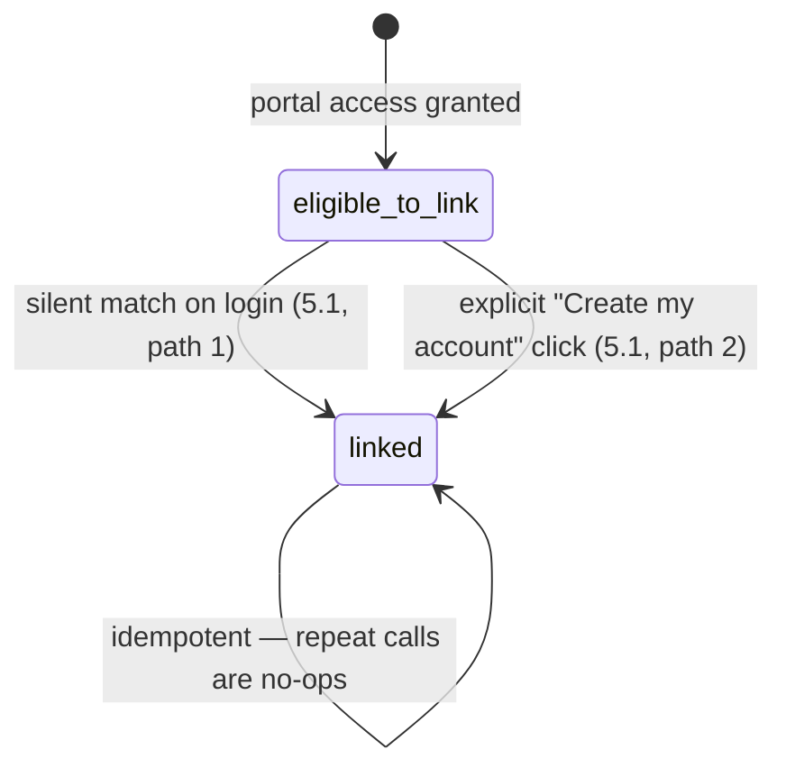

# Employee Portal Self-Service Blueprint

**Status:** implementation-ready specification for PHASE 18.5's own named
remaining gap (`docs/PHASE.md` — "Employee portal (auth and self-service)",
BD-105). This document is a specification to be implemented under
`PHASE.md`'s authorized queue — it is not itself a queue, and nothing here is
built until `PHASE.md` sequences it. It does not modify `PHASE.md` or
`ROADMAP.md`.

This document does not repeat what `AGENTS.md`, `DOMAIN_MODEL.md`,
`DATABASE.md`, `docs/DECISIONS.md` (ADR-012, ADR-013) and the Stage 14/18
corporate foundation already establish; it assumes them. Where a new idea
would duplicate or compete with an existing mechanism —
`AppointmentRepository.findByCustomer`/`requestAppointment`,
`CustomerAlterationRepository`, `OrderRepository.findByCustomer`,
`link_my_customer_accounts`/`customer_account_links`, `assertRetailerModuleActive`,
the existing `/employee` route tree — this document extends that mechanism
by name rather than inventing a second system that does the same job
differently. Every code identifier named below is either an existing symbol
(cited with its file path) or a new symbol this document defines once and
uses consistently.

**Author's note on scope discipline:** 18.5's owner boundary names six
surfaces — appointments, measurements, wardrobe, orders, alterations,
announcements. This document builds a complete, unblocking foundation
(identity linking) plus three of the six (appointments, orders, alterations)
to full implementation-ready detail, because those three are directly and
safely buildable today with existing primitives. The remaining three
(measurements, wardrobe, announcements) are each explicitly scoped out in
§12 with the concrete, named reason implementation must not proceed without
resolving first — not because they are less important, but because building
any of them today would mean inventing an under-designed data model or
touching a file another active lane currently owns. Producing a rushed,
under-specified design for those three would violate this document's own
purpose more than leaving them named and deferred.

---

## 0. Reuse map — what already exists vs what this document adds

| Capability                                              | Real PAON mechanism                                                                                          | Status                                                                     |
| ------------------------------------------------------- | ------------------------------------------------------------------------------------------------------------ | -------------------------------------------------------------------------- |
| Wearer identity, session, RLS, magic-link auth          | `corporate_wearer` `AccountType`, `current_wearer_id()`, `/employee/login`, `/employee/auth/confirm`         | **Exists** (PHASE 18.5, landed 2026-08-04/05)                              |
| Programme, entitlement balance, issue history           | `CorporateRepository`, `computeEntitlementBalance` (`packages/domain/src/corporate/corporate-programme.ts`)  | **Exists**                                                                 |
| Wearer-initiated service requests (incl. alterations)   | `corporate_exceptions`, `RaiseRequestForm`, `WEARER_RAISABLE_EXCEPTION_KINDS`                                | **Exists** (PHASE 18.8)                                                    |
| "Link an auth user to a domain row" pattern             | `sync_retailer_staff_claim`, `link_my_customer_accounts`, `link_my_wearer_account` — three prior instances   | **Exists** — this document is the fourth, reusing the exact shape          |
| Multi-tenant identity that can hold many relationships  | `customers.user_id = auth.uid()` direct RLS, `customer_account_links` (ADR-013)                              | **Exists** — this document's linking design is built directly on top of it |
| Customer-scoped appointment read/write                  | `AppointmentRepository.findByCustomer`/`.requestAppointment`, `request_appointment` RPC                      | **Exists**, reused unchanged                                               |
| Customer-scoped order read                              | `OrderRepository.findByCustomer`                                                                             | **Exists**, reused unchanged                                               |
| Customer-scoped alteration read (column-minimized)      | `CustomerAlterationRepository`, `customer_alteration_work_orders`/`customer_alteration_status_history` views | **Exists**, reused unchanged                                               |
| Module-gated customer entry points                      | `assertRetailerModuleActive` (`apps/customer/lib/module-session.ts`)                                         | **Exists**, reused unchanged                                               |
| Auto-create a `customers` row on first real interaction | `request_appointment` RPC (customer creation branch)                                                         | **Exists** — precedent this document's opt-in creation path matches        |

**The only genuinely missing capability** is the connective tissue between a
`corporate_wearers` row and a real `customers` row, and the three
wearer-facing read/write surfaces that become possible once that connection
exists. No new `Appointment`, `Order`, or `Alteration` concept. No new
top-level customer-app entity. Concretely: no shadow-customer auto-creation
(explicitly rejected — see §3.1), no widened `ConsentPurpose` or
`ConversationIntent` enum, no new commerce/checkout capability for wearers.

---

## 1. Founder intent

**Owner boundary (PHASE.md, unchanged):** "a low-friction, mobile-first,
simple-auth session for a corporate-programme employee — appointments,
measurements, wardrobe, orders, alterations, tickets, announcements. Never
the retailer-staff session type, never broader RLS access than the
employee's own wearer row and its programme's published readiness."

**Why this matters commercially.** A PAON Métier corporate programme (Stage
14/18) issues garments to a company's employees under a negotiated
entitlement policy. Today, once portal access is granted, a wearer can see
their entitlement balance and issue history, and can raise a problem
report. They cannot book a fitting, see an order's delivery status, or check
an alteration's progress — every one of those requires either a phone call
to the retailer or, if they happen to already be a shopper at the same
retailer, logging into a completely separate `/dashboard` session (which
their `/employee` session cannot even reach — see §3). This is the single
largest visible gap between what the corporate pilot promises ("a low-
friction, mobile-first... session") and what exists. Closing it is what
turns the Employee Portal from an entitlement-lookup tool into the genuine
self-service surface the founder specified, and is the direct dependency
`18.13` (end-to-end lifecycle hardening) needs to call this chapter real.

**Non-goals (unchanged from PHASE.md):** not an HR login; no employment data
beyond what `14.1` already deliberately excludes (no salary, no manager
hierarchy, no performance field — see `corporate-programme.ts`'s own file
header); a leaver is an entitlement event, never a termination record.

**New non-goal this document adds explicitly:** a wearer's identity link to
a `customers` row is never fabricated or forced. A `customers` row is
created only at the wearer's own explicit, informed request (§3.3), exactly
mirroring `18.4`'s own precedent ("a scheduled office visit is a real person
choosing to engage the retailer directly... deliberately not the per-wearer
shadow-customer pattern `18.6` explicitly rejected for its own different
case"). §3.1 restates why a forced link is architecturally prohibited, not
merely undesirable.

---

## 2. User journeys

### Journey A — Silent match (the common case for an existing shopper)

Maria is a wearer at Acme Corp's PAON Métier programme with the retailer
"Sartoria Bianchi." She has also, independently, been a Sartoria Bianchi
customer for two years under the same email address.

1. Maria receives her portal-access magic link, clicks it.
2. `/employee/auth/confirm` runs `link_my_wearer_account()` (extended, §4.3)
   — as a side effect of the SAME call, it detects her email already matches
   a `customers` row at Sartoria Bianchi and links `corporate_wearers.customer_id`
   to it. No new customer record is created — none was needed.
3. She lands on `/employee`. Below her existing entitlement/issue-history
   cards, three new sections now render with real data: her two upcoming
   appointments, her one in-progress alteration, her order history.
4. She never sees a "connect your account" prompt. It already worked.

### Journey B — Opt-in creation (the new-to-this-retailer case)

Tom is a wearer at Acme Corp. He has never bought anything from Sartoria
Bianchi as an individual.

1. Tom signs in via his portal magic link, lands on `/employee`.
2. Below his entitlement/issue-history cards, instead of the three new
   sections, he sees one clearly-optional card: "Also shop with Sartoria
   Bianchi? Create your own customer account to book appointments, track
   orders and see alteration status." A single "Create my account" button,
   his own name pre-filled, editable.
3. He clicks it. `create_and_link_wearer_customer_account()` (§4.4) creates a
   real `customers` row (`lifecycle_stage: 'prospect'`, exactly like
   `request_appointment`'s own first-interaction creation), links it to his
   `corporate_wearers.customer_id`, and the page re-renders with the three
   sections now visible (empty — he has no appointments/orders/alterations
   yet, honestly rendered as such).
4. He can now use "Book an appointment" (§2, Journey C).

### Journey C — Booking an appointment from the portal

Continuing from Journey B, Tom wants a fitting.

1. On `/employee/appointments`, he sees "No upcoming appointments" and a
   "Request an appointment" form (type, preferred date/time, notes) —
   visually and functionally identical to the existing customer-facing
   appointment request form (`apps/customer/app/r/[slug]/appointments/appointment-request-form.tsx`),
   reused as a client component, not re-implemented.
2. Submitting calls the wearer-scoped Server Action (§5.2), which gates on
   `relationship_intelligence` being active for Sartoria Bianchi
   (`assertRetailerModuleActive`) and calls the existing, unmodified
   `AppointmentRepository.requestAppointment`. The underlying
   `request_appointment` RPC re-derives Tom's own `customers` row from
   `auth.uid()` — since his wearer session's `auth.uid()` is literally the
   same auth user as his newly-linked customer, this works without any RPC
   change.
3. He's redirected to `/employee/appointments`, sees "Requested" status.
4. Retailer staff see and confirm it through the existing, unmodified
   `/appointments` retailer-portal flow — a wearer's appointment is, from
   that point on, an ordinary appointment. No corporate-specific handling
   downstream.

### Journey D — Colleague isolation (negative case, must hold)

Priya is another Acme Corp wearer in the same programme as Maria.

1. Priya signs in to her own `/employee` session.
2. She sees only her own linked-customer's appointments/orders/alterations
   — never Maria's, never any other wearer's, regardless of whether they
   share a programme, a company, or even the same physical fitting day. RLS
   enforces this identically to how it already enforces it for two
   unrelated ordinary customers — see §8.

---

## 3. The core architectural decision: wearer ↔ customer identity linking

### 3.1 Why a forced/automatic shadow customer is prohibited

`PHASE.md` 18.6's own status text is explicit and binding: _"Forcing a
shadow `customers` row into existence per wearer just to satisfy that
column, purely to reuse the appointments table, would have created the
'shadow customer per employee' `14.1` explicitly built
`corporate_wearers.customer_id` as nullable to avoid."_ This is not a style
preference; it is a standing architectural constraint from an already-shipped
decision (18.6's own rollout-slot design deliberately does NOT go through
`appointments` for exactly this reason). This document's design must — and
does — satisfy the owner boundary's "appointments, orders, alterations"
requirement without contradicting it.

### 3.2 The decision

**Every wearer keeps `corporate_wearers.customer_id` nullable, exactly as
today.** A `customers` row is linked to a wearer through exactly two paths,
both of which respect "never fabricate a shopper who doesn't want to be
one":

1. **Silent match-on-login** (Journey A): if a `customers` row already
   exists at the wearer's own `retailer_id` whose `user_id` (via
   `customer_account_links`, or directly) equals the wearer's own
   `auth.uid()`, link it automatically. This creates nothing new — it only
   recognizes a relationship that already, independently, exists. This is
   the same trust boundary `link_my_customer_accounts()` already operates
   under for ordinary multi-retailer customers (ADR-013): idempotent,
   re-derived entirely from `auth.uid()`/`auth.jwt() ->> 'email'`, safe to
   call on every session.

2. **Explicit opt-in creation** (Journey B): if no match exists, the wearer
   is shown — never forced through — a single clearly-labelled action that
   creates a real `customers` row only when they click it. This mirrors
   `18.4`'s own "a real person choosing to engage the retailer directly"
   precedent for office-visit scheduling, and `request_appointment`'s own
   first-interaction customer-creation shape (same `lifecycle_stage:
'prospect'` default, same "the customer relationship is created by the
   customer's own action, not manufactured ahead of it" principle).

Once `corporate_wearers.customer_id` is set (by either path), it is treated
identically by every downstream read: `AppointmentRepository`,
`OrderRepository`, `CustomerAlterationRepository` all key off the linked
`customerId`, completely unaware that the caller arrived via `/employee`
rather than `/dashboard`.

### 3.3 Why this is not the same as a shadow customer

The rejected pattern (18.6) is: _the system silently creates a customer
record for every wearer, whether they want one or not, to satisfy a foreign
key._ This document's pattern is: _a customer record is either recognized
(already existed, independently) or created by the wearer's own single
explicit click, exactly the way any other new-to-this-retailer shopper's
first `customers` row is created (via `request_appointment`,
`add_to_cart`, or the storefront checkout)._ The wearer's employment
relationship never causes a customer relationship to exist; only the
wearer's own shopping intent does — the same causal direction PAON already
enforces for every other "does a Customer row exist yet" case in the
codebase.

---

## 4. Domain model additions

No new entities. `CorporateWearer` (`packages/domain/src/corporate/corporate-programme.ts`)
already has `readonly customerId?: CustomerId` — unchanged. This section
adds only the small set of pure functions/types needed to express the
linking decision and the wearer-facing appointment-request wrapper.

### 4.1 `packages/domain/src/corporate/corporate-programme.ts` — no change

`CorporateWearer.customerId` is already optional and already the correct
shape. Nothing here changes.

### 4.2 New file: `packages/domain/src/corporate/wearer-customer-link.ts`

```ts
/**
 * PHASE 18.5's own named gap: linking a corporate_wearers row to a real
 * customers row, without ever fabricating a shopper who did not choose to
 * be one (see EMPLOYEE_PORTAL_SELF_SERVICE_BLUEPRINT.md §3). Pure
 * presentation-state logic only — the actual linking/creation is two
 * `security definer` RPCs (§6.3/§6.4); this file has no side effects.
 */

export type WearerCustomerLinkState =
  | "linked" // corporate_wearers.customer_id is set
  | "eligible_to_link"; // not yet set — the opt-in CTA renders

export function wearerCustomerLinkState(params: {
  readonly customerId?: string;
}): WearerCustomerLinkState {
  return params.customerId ? "linked" : "eligible_to_link";
}
```

That is the entire domain addition for the linking mechanism itself — a
two-value state derived from one existing optional field. The linking logic
that matters (matching by email, creating the row) lives in SQL, per
ADR-013's own precedent that `link_my_customer_accounts` is itself pure SQL,
not application-layer logic re-derivable from a client call.

### 4.3 Reused, unchanged: appointment/order/alteration domain types

`Appointment`, `AppointmentType`, `AppointmentStatus`
(`packages/domain/src/appointments/appointment.ts`), `Order`
(`packages/domain/src/commerce/...`), `CustomerAlterationSummary`
(`packages/domain/src/production/production.ts`) — all reused verbatim. No
wearer-specific appointment/order/alteration type is created; a wearer's
appointment IS an `Appointment`, full stop.

---

## 5. Database changes

### 5.1 Migration: `add_wearer_customer_account_linking.sql`

No RLS policy changes are needed on `appointments`, `orders`,
`customer_alteration_work_orders`, or `customer_alteration_status_history` —
their existing policies already key off `customers.user_id = auth.uid()`
(ADR-013), and a linked wearer's `auth.uid()` is, by construction, the same
`auth.uid()` as their own linked customer row. This is the entire point of
linking through `customer_id`/`user_id` rather than inventing a parallel
wearer-scoped policy family.

```sql
-- PHASE 18.5: wearer <-> customer identity linking. See
-- docs/EMPLOYEE_PORTAL_SELF_SERVICE_BLUEPRINT.md §3 for why this is
-- deliberately never automatic/forced creation (PHASE.md 18.6's own
-- "no shadow customer" constraint).

-- ---------------------------------------------------------------------
-- Extend link_my_wearer_account(): after linking the wearer's own
-- user_id (unchanged, existing behaviour), additionally attempt a
-- silent match against an existing customers row at the SAME retailer.
-- Idempotent: a wearer already linked to a customer is left untouched;
-- re-running this on every session is safe, matching every other
-- instance of this "link an auth user to a domain row" pattern.
-- ---------------------------------------------------------------------
create or replace function public.link_my_wearer_account()
returns void
language plpgsql
security definer
set search_path = public
as $$
declare
  v_email text := auth.jwt() ->> 'email';
  v_wearer public.corporate_wearers%rowtype;
begin
  if v_email is null then
    return;
  end if;

  update public.corporate_wearers
    set user_id = auth.uid()
    where lower(login_email) = lower(v_email)
      and user_id is null
      and deleted_at is null;

  select * into v_wearer
    from public.corporate_wearers
    where user_id = auth.uid()
      and deleted_at is null
    limit 1;

  if not found or v_wearer.customer_id is not null then
    return;
  end if;

  -- Silent match only: never inserts. A real customers row must
  -- already exist, at the SAME retailer as the wearer's own programme,
  -- with the SAME auth.uid() already linked to it (via the existing
  -- customers.user_id / customer_account_links mechanism this reuses
  -- unchanged) — never merely a matching email on an unlinked row,
  -- which would let a wearer silently claim a stranger's prospect
  -- record.
  update public.corporate_wearers
    set customer_id = c.id
    from public.customers c
    where public.corporate_wearers.id = v_wearer.id
      and c.retailer_id = v_wearer.retailer_id
      and c.user_id = auth.uid()
      and c.deleted_at is null;
end;
$$;

-- ---------------------------------------------------------------------
-- create_and_link_wearer_customer_account(): the explicit opt-in path
-- (Journey B). Re-derives the caller's own wearer row from auth.uid()
-- — never trusts a client-supplied wearer/customer id, the same
-- discipline `join_wedding_party`/`redeem_gift_invitation` already use.
-- Idempotent: calling it twice returns the same existing customer_id
-- rather than creating a second row.
-- ---------------------------------------------------------------------
create or replace function public.create_and_link_wearer_customer_account()
returns uuid
language plpgsql
security definer
set search_path = public
as $$
declare
  v_wearer public.corporate_wearers%rowtype;
  v_email text := auth.jwt() ->> 'email';
  v_customer_id uuid;
begin
  select * into v_wearer
    from public.corporate_wearers
    where user_id = auth.uid()
      and deleted_at is null
    limit 1;

  if not found then
    raise exception 'No employee record for this session';
  end if;

  if v_wearer.customer_id is not null then
    return v_wearer.customer_id;
  end if;

  if v_email is null then
    raise exception 'No verified email on this session';
  end if;

  -- Re-check for a silent match one more time under lock — a wearer
  -- who became a customer through the ordinary storefront in the
  -- moments between page load and this click must not get a second,
  -- duplicate customers row.
  select c.id into v_customer_id
    from public.customers c
    where c.retailer_id = v_wearer.retailer_id
      and c.user_id = auth.uid()
      and c.deleted_at is null
    limit 1;

  if v_customer_id is null then
    insert into public.customers (
      retailer_id, user_id, full_name, email, lifecycle_stage
    ) values (
      v_wearer.retailer_id, auth.uid(), v_wearer.display_name, v_email, 'prospect'
    )
    returning id into v_customer_id;

    insert into public.customer_account_links (user_id, customer_id, retailer_id)
    values (auth.uid(), v_customer_id, v_wearer.retailer_id)
    on conflict (user_id, customer_id) do nothing;
  end if;

  update public.corporate_wearers
    set customer_id = v_customer_id
    where id = v_wearer.id;

  return v_customer_id;
end;
$$;

revoke all on function public.create_and_link_wearer_customer_account() from public;
grant execute on function public.create_and_link_wearer_customer_account()
  to authenticated, service_role;

comment on function public.create_and_link_wearer_customer_account() is
  'PHASE 18.5 (BD-105). Explicit wearer opt-in: creates and links a real customers row only when the wearer themselves requests it. Never automatic — see EMPLOYEE_PORTAL_SELF_SERVICE_BLUEPRINT.md §3.';
```

**Why `create_and_link_wearer_customer_account()` is a separate function
from `link_my_wearer_account()` rather than one function with a flag:** the
former has a real, consequential side effect (creates a row) triggered by
an explicit user action; the latter runs silently on every session
establishment. Conflating them would make the silent, safe-to-call-always
path accidentally capable of row creation if a caller ever passed the wrong
flag — the same "narrow RPC per distinct authority, never one RPC with a
mode switch that widens what a silent call can do" discipline this
codebase already applies to `transition_service_booking` vs
`request_service_booking`.

### 5.2 No RLS policy changes required beyond the two functions above

Confirmed by inspection: `appointments` ("a customer can read their own
appointments" — `c.user_id = auth.uid()`), `customer_alteration_work_orders`/
`customer_alteration_status_history` (security-barrier views already scoped
to `customer_id`'s own `user_id`), and `orders` (equivalent `customers`-owner
policy) all resolve correctly for a linked wearer with zero policy edits,
because `corporate_wearers.customer_id`'s target row's `user_id` is, by
construction, the wearer's own `auth.uid()`.

---

## 6. Repositories

### 6.1 `CorporateRepository` (`packages/database/src/repositories/corporate-repository.ts`) — two new methods

```ts
/** §3.2 path 1 — silent match, safe to call every session. Already
 * folded into linkMyWearerAccount's own RPC (5.1); this method exists
 * only because linkMyWearerAccount() is the one call site every
 * session already makes (see apps/customer/app/employee/auth/confirm/route.ts) —
 * no new call site needed for the silent-match half. */
// linkMyWearerAccount(): Promise<void>  — UNCHANGED signature, extended RPC body.

/** §3.2 path 2 — explicit opt-in creation. Returns the linked customer's
 * id so the calling Server Action can immediately fetch their (empty)
 * appointments/orders/alterations without a second round trip. */
async createAndLinkWearerCustomerAccount(): Promise<string> {
  const { data, error } = await this.client.rpc(
    "create_and_link_wearer_customer_account",
  );
  if (error) throw error;
  return data as string;
}
```

### 6.2 `findWearerById` — unchanged

Already returns `customerId?: CustomerId` on the mapped `CorporateWearer`
(`toWearer` in `corporate-repository.ts` already reads
`row.customer_id`) — confirmed by inspection, zero change needed. The
`/employee` page's existing `repo.findWearerById(session.wearerId)` call
already carries everything §7's new page logic needs.

### 6.3 `AppointmentRepository`, `OrderRepository`, `CustomerAlterationRepository` — unchanged

All three already expose `findByCustomer(customerId)`. `AppointmentRepository`
already exposes `requestAppointment` (the wrapper around `request_appointment`).
Zero repository changes.

---

## 7. Server Actions / routes

New route tree under the existing `/employee` prefix (already covered by
`apps/customer/middleware.ts`'s `EMPLOYEE_PATH_PREFIX` carve-out — no
middleware change needed):

```
apps/customer/app/employee/
  page.tsx                          (existing — gains the link-state card, §7.1)
  link-account-actions.ts           (new — §7.2)
  appointments/
    page.tsx                        (new — §7.3)
    actions.ts                      (new — §7.4, thin wrapper)
    appointment-request-form.tsx    (new — thin re-export/reuse of the existing
                                      customer-facing form component, restyled
                                      only if the existing one assumes a
                                      /r/[slug] route param this context lacks)
  orders/
    page.tsx                        (new — §7.5, read-only)
  alterations/
    page.tsx                        (new — §7.6, read-only)
```

### 7.1 `page.tsx` — link-state card

After the existing "Report a problem" card, add:

```tsx
{
  wearerCustomerLinkState({ customerId: wearer.customerId }) ===
  "eligible_to_link" ? (
    <Card className="flex flex-col gap-3">
      <h2 className="text-lg font-medium text-[var(--color-stone-900)]">
        Also shop with {programme?.name ? retailer?.displayName : "us"}?
      </h2>
      <p className="text-sm text-[var(--color-stone-500)]">
        Create your own customer account to book appointments, track orders and
        see alteration status. Optional — your employee entitlement works
        exactly the same either way.
      </p>
      <form action={createAndLinkWearerCustomerAccount}>
        <Button type="submit">Create my account</Button>
      </form>
    </Card>
  ) : (
    <>{/* §7.3–7.6 summary cards/links, only rendered once linked */}</>
  );
}
```

`retailer` must be fetched alongside `programme` via
`RetailerRepository.findById(wearer.retailerId)` (existing repository,
already used identically in `apps/customer/app/(dashboard)/wardrobe/page.tsx`)
— one additional `Promise.all` member, no new pattern.

### 7.2 `link-account-actions.ts`

```ts
"use server";

import { CorporateRepository } from "@paon/database";
import { revalidatePath } from "next/cache";

import { requireWearerAppSession } from "@/lib/session";
import { getSupabaseServerClient } from "@/lib/supabase-server";

export async function createAndLinkWearerCustomerAccount(): Promise<void> {
  await requireWearerAppSession();
  await new CorporateRepository(
    await getSupabaseServerClient(),
  ).createAndLinkWearerCustomerAccount();
  revalidatePath("/employee");
}
```

No form fields, no zod schema needed — the RPC re-derives everything from
the session server-side (§5.1). This matches `linkMyWearerAccount`'s own
zero-argument shape.

### 7.3 `/employee/appointments/page.tsx`

```tsx
import { AppointmentRepository, CorporateRepository } from "@paon/database";
import { APPOINTMENT_TYPE_LABELS, wearerCustomerLinkState } from "@paon/domain";
import { Card } from "@paon/ui/components/Card";
import { formatDate } from "@paon/utils";

import { AppointmentStatusBadge } from "@/app/(dashboard)/appointments/status-badge";
import { WearerAppointmentRequestForm } from "./appointment-request-form";
import { requireWearerAppSession } from "@/lib/session";
import { getSupabaseServerClient } from "@/lib/supabase-server";

export default async function EmployeeAppointmentsPage() {
  const session = await requireWearerAppSession();
  const supabase = await getSupabaseServerClient();
  const repo = new CorporateRepository(supabase);
  const wearer = await repo.findWearerById(session.wearerId);

  if (!wearer || wearerCustomerLinkState(wearer) !== "linked") {
    // Honest empty state, matching page.tsx's own existing "your
    // employee record could not be found" precedent — never a silent
    // redirect a wearer can't understand.
    return (
      <main className="mx-auto max-w-lg px-6 py-12">
        <p className="text-sm text-[var(--color-stone-700)]">
          Create your customer account from the Employee Portal home page first
          to book appointments.
        </p>
      </main>
    );
  }

  const appointments = await new AppointmentRepository(supabase).findByCustomer(
    wearer.customerId!,
  );

  return (
    <main className="mx-auto flex max-w-lg flex-col gap-6 px-6 py-12">
      <h1 className="font-display text-3xl text-[var(--color-stone-900)]">
        Your appointments
      </h1>
      {appointments.length === 0 ? (
        <p className="text-sm text-[var(--color-stone-500)]">
          No appointments yet.
        </p>
      ) : (
        <ul className="flex flex-col gap-3">
          {appointments.map((appointment) => (
            <Card
              key={appointment.id}
              className="flex items-center justify-between"
            >
              <div>
                <p className="text-sm font-medium">
                  {APPOINTMENT_TYPE_LABELS[appointment.type]}
                </p>
                <p className="text-xs text-[var(--color-stone-500)]">
                  {formatDate(appointment.startsAt)}
                </p>
              </div>
              <AppointmentStatusBadge status={appointment.status} />
            </Card>
          ))}
        </ul>
      )}
      <WearerAppointmentRequestForm retailerId={wearer.retailerId} />
    </main>
  );
}
```

`AppointmentStatusBadge` is imported and reused from the existing customer
appointments page, not duplicated.

### 7.4 `appointments/actions.ts`

```ts
"use server";

import { AppointmentRepository } from "@paon/database";
import { asId, requestAppointmentInputSchema } from "@paon/domain";

import { assertRetailerModuleActive } from "@/lib/module-session";
import { requireWearerAppSession } from "@/lib/session";
import { getSupabaseServerClient } from "@/lib/supabase-server";

export async function requestWearerAppointment(
  _prevState: { fieldErrors: Record<string, string>; formError?: string },
  formData: FormData,
) {
  await requireWearerAppSession();
  const parsed = requestAppointmentInputSchema.safeParse({
    retailerId: formData.get("retailerId"),
    type: formData.get("type"),
    startsAt: formData.get("startsAt"),
    endsAt: formData.get("endsAt"),
    notes: formData.get("notes") || undefined,
  });
  if (!parsed.success) {
    const fieldErrors: Record<string, string> = {};
    for (const issue of parsed.error.issues) {
      fieldErrors[issue.path.join(".")] ??= issue.message;
    }
    return { fieldErrors };
  }

  const supabase = await getSupabaseServerClient();
  const rId = asId<"RetailerId">(parsed.data.retailerId);
  try {
    await assertRetailerModuleActive(
      supabase,
      rId,
      "relationship_intelligence",
    );
    await new AppointmentRepository(supabase).requestAppointment({
      retailerId: rId,
      type: parsed.data.type,
      startsAt: parsed.data.startsAt,
      endsAt: parsed.data.endsAt,
      ...(parsed.data.notes ? { notes: parsed.data.notes } : {}),
    });
  } catch (error) {
    return {
      fieldErrors: {},
      formError:
        error instanceof Error
          ? error.message
          : "Could not request appointment.",
    };
  }
  return { fieldErrors: {}, success: true };
}
```

This is a near-byte-identical wrapper of the existing
`apps/customer/app/r/[slug]/appointments/actions.ts:requestAppointment` —
duplicated deliberately (not imported) only because the original hard-codes
a `redirect` to `/r/[slug]/appointments` and reads `slug` from its own
route params, neither of which apply inside `/employee`. If a future
refactor wants to de-duplicate the shared body (parse → gate → call RPC),
extract a shared helper in `packages/domain` or a shared `apps/customer/lib/`
module at that time — not required for this document's acceptance criteria.

### 7.5 `/employee/orders/page.tsx` — read-only, same shape as §7.3 without the form

Mirrors `apps/customer/app/(dashboard)/orders/page.tsx` exactly, scoped to
one `wearer.customerId` instead of looping over `CustomerRepository.findByUserId`'s
multiple relationships (a wearer's employee-portal customer relationship is,
by definition, exactly one retailer).

### 7.6 `/employee/alterations/page.tsx` — read-only

Mirrors the equivalent customer-facing alterations view (using
`CustomerAlterationRepository.findByCustomer`/`.findTimeline`), same
single-customer scoping as §7.5. No new "request an alteration" action here
— that already exists via the existing "Report a problem" form's
`alteration_request` kind (§0 table, `WEARER_RAISABLE_EXCEPTION_KINDS`).

---

## 8. State machine

The only new state machine this document introduces is the two-value
`WearerCustomerLinkState` (§4.2) — a wearer is either `eligible_to_link` or
`linked`, transitioning exactly once, in exactly one direction (no unlink
path is specified; unlinking a wearer's own customer relationship is out of
scope — see §12 non-goals). Every downstream state (`AppointmentStatus`,
`OrderStatus`, alteration `status`) is the existing, unmodified state
machine already governing ordinary customer appointments/orders/alterations
— a wearer's appointment moves through `requested → confirmed → checked_in
→ completed`/`canceled`/`no_show` exactly like any other appointment,
because it IS an ordinary `Appointment` row, not a parallel wearer-specific
type.



---

## 9. Permissions

| Actor                               | Can read                                                                                                             | Can write                                                                                                                   |
| ----------------------------------- | -------------------------------------------------------------------------------------------------------------------- | --------------------------------------------------------------------------------------------------------------------------- |
| The wearer themselves               | Own `corporate_wearers` row, own programme (published fields), own linked customer's appointments/orders/alterations | `create_and_link_wearer_customer_account()` (once); `request_appointment` (via existing RPC)                                |
| A colleague in the same programme   | Nothing of the above — no policy grants cross-wearer read at any point                                               | Nothing                                                                                                                     |
| Retailer staff (`sales_associate`+) | Everything they already can for any customer/appointment/order/alteration at their retailer — unchanged              | Unchanged — a wearer's linked appointment/order/alteration is an ordinary staff-manageable object from the moment it exists |
| Platform staff                      | Unchanged existing platform-wide read policies                                                                       | Unchanged                                                                                                                   |

No new role, no new module. `enterprise_verticals` (the corporate module)
continues to gate the wearer's OWN portal access and entitlement/issue
data, unchanged. The three new sections are gated by the SAME module their
retailer-side/customer-side equivalents already use
(`relationship_intelligence` for appointments, `commerce_growth` for orders,
`garment_service_operations` for alterations) — a wearer viewing "their own
appointments" is the identical capability a customer already has, reached
through a different auth path, and must respect the same module-off
suppression an ordinary customer already does.

---

## 10. AI interactions

**None.** This slice introduces no AI-generated content, no
`ai_generations` row, no provider call. Explicitly noted per this
document's required-sections list so a future reader does not go looking
for one that was never intended.

---

## 11. Notifications

No new notification type. The existing appointment-confirmation,
order-status, and alteration-progress notifications (already dispatched to
whichever `auth.uid()` owns the underlying `customers` row, via the
existing `notifications` table and delivery paths) reach a linked wearer
automatically and unchanged, because notification delivery already keys off
`recipient_user_id`, which is the wearer's own `auth.uid()` regardless of
which portal they signed in through. No wearer-specific notification
copy is required; existing copy is retailer/appointment/order language, not
"customer portal" language, and reads correctly either way.

---

## 12. Explicitly deferred (not built by this document)

- **Measurements beyond entitlement.** The owner boundary's "measurements"
  clause refers to the general customer measurement/fit system
  (`MeasurementMonitor`, PHASE 12.1, itself unchecked/legacy — see
  `docs/CAPABILITY_DISPOSITION.md`'s Stage 8–16 map) or `FitProfileCandidate`
  (FT-01). `agent/lane-a-ft01-fitprofile` currently has active, uncommitted
  work on `packages/domain/src/production/production.ts` and
  `fit-profile-candidate-repository.ts` — the exact files a wearer-facing
  measurements view would need to read. Per `AGENTS.md`'s rule against
  editing a file another active lane owns, this document deliberately does
  not design that surface. **Unblocked when:** lane-a's FT-01 work lands and
  its final `FitProfileCandidate`/measurement-read shape is stable.

- **Wardrobe.** Corporate-issued garments are tracked as loose
  `garmentKey`/`quantity` strings on `corporate_issue_records` — there is no
  existing mapping from a `garmentKey` to a `GarmentCategoryCode`
  (`wardrobe_items.category_code`'s own required field), so "issued items
  show up in the employee's digital wardrobe" cannot be built today without
  first designing that mapping (a real, separate decision: does the
  retailer choose a category when issuing, or is it inferred from the
  `garmentKey` string, or does `corporate_issue_records` gain its own
  `categoryCode` column at issuance time?). **Unblocked when:** that mapping
  decision is made — recommend a follow-up blueprint scoped narrowly to
  this one question, reusing `WardrobeRepository.createExternalItem`
  unchanged once the category is known.

- **Announcements.** The only existing announcements feature
  (`apps/retailer/app/(dashboard)/staff/announcements`) is staff-facing —
  internal team communication, not employer-to-employee-programme
  broadcast. A programme-level announcement (a manager posting "new batch
  arriving next week" visible to every wearer in a programme) is a
  genuinely new, small domain concept (`ProgrammeAnnouncement`: retailer_id,
  programme_id, staff-authored, wearer-read RLS mirroring
  `corporate_programmes_wearer_select`'s own shape) that this document does
  not design because it has no existing mechanism to extend — it would be
  invented, not reused, and this document's own discipline (§0) is to
  extend named mechanisms, not invent new ones inside a blueprint whose
  primary job is unblocking the identity-linking foundation. **Unblocked
  when:** the founder confirms this is wanted as a distinct concept from
  staff announcements (it may not be — a manager could reasonably just use
  the existing service-desk conversation thread per wearer instead).

- **Un-linking.** No path is specified for a wearer to disconnect their
  customer account once linked. Given the link only ever represents a
  relationship the wearer themselves chose or that already existed
  independently, this is treated as a genuinely rare edge case (equivalent
  to "I want to delete my customer account," already out of scope for the
  ordinary Customer Portal too) rather than a gap in this slice.

- **Wearer self-checkout/ordering.** "Orders" in this document means
  read-only order history. Whether a corporate wearer should be able to
  self-purchase beyond their entitlement (a genuine commercial/payment
  question — who pays, does it count against entitlement, does it need
  employer approval) is explicitly out of scope and not implied by
  anything in this document.

---

## 13. Edge cases

| Case                                                                                                                               | Behavior                                                                                                                                                                                                                                                                                                                                                             |
| ---------------------------------------------------------------------------------------------------------------------------------- | -------------------------------------------------------------------------------------------------------------------------------------------------------------------------------------------------------------------------------------------------------------------------------------------------------------------------------------------------------------------- |
| Wearer's email matches a customer at a **different** retailer than their programme's                                               | Never linked — `create_and_link_wearer_customer_account`/the silent-match update both filter `c.retailer_id = v_wearer.retailer_id` explicitly.                                                                                                                                                                                                                      |
| Wearer clicks "Create my account" twice quickly (double submit)                                                                    | Idempotent — second call finds `customer_id` already set (or finds the same match under the second `select` before insert) and returns the same id, no duplicate row.                                                                                                                                                                                                |
| Wearer's programme/retailer module (`relationship_intelligence`, `commerce_growth`, `garment_service_operations`) is off/suspended | The relevant section's write action fails closed via `assertRetailerModuleActive`, matching every other customer-app entry point's existing behavior; reads (§7.3/7.5/7.6) still render existing rows — module state does not retroactively hide history, matching precedent elsewhere in this codebase (module-off blocks new writes, not existing reads).          |
| Wearer becomes an ordinary customer through the storefront (not `/employee`) **after** already being linked                        | No-op — `corporate_wearers.customer_id` is already set; `link_my_customer_accounts()` (the ordinary customer-portal linking call) and this document's `link_my_wearer_account()` extension both operate on the same underlying `customers`/`customer_account_links` rows without conflict, since neither ever un-sets a value the other set.                         |
| Two different wearers (different programmes, same retailer) share the same real-world email                                        | Cannot happen without also being the same `auth.uid()` — `customers.user_id = auth.uid()` is per-person, not per-programme; the silent match keys off `auth.uid()`, never off email string equality across two different people.                                                                                                                                     |
| Wearer's employer offboards them (`corporate_wearers.active = false` or soft-deleted)                                              | RLS already denies wearer-scoped reads once `deleted_at`/inactive per existing 18.5 policies (unchanged by this document); their LINKED customer relationship (if any) is untouched — they simply lose `/employee` access, exactly as today, while any customer relationship they separately chose to create continues to work through the ordinary Customer Portal. |

---

## 14. Acceptance criteria

1. A wearer whose email already matches an existing `customers` row at
   their own programme's retailer sees appointments/orders/alterations
   sections on first `/employee` login, with zero extra clicks — proven
   against a real seeded match, not asserted from code reading alone.
2. A wearer with no existing match sees the opt-in card, not the three
   sections; clicking "Create my account" creates exactly one new
   `customers` row (proven via direct database assertion, not UI text
   alone) and immediately reveals the three sections, now honestly empty.
3. Clicking "Create my account" twice (a double-submit or a second visit)
   never creates a second `customers` row — proven by asserting exactly
   one row exists after both attempts.
4. A wearer can request an appointment from `/employee/appointments`; the
   resulting row is a real `appointments` row with `customer_id` equal to
   their own linked customer, visible to retailer staff through the
   existing, completely unmodified `/appointments` retailer flow.
5. Two wearers in the same programme (real, separately seeded wearers)
   never see each other's appointments/orders/alterations, regardless of
   whether either has linked a customer account — proven by seeding both
   with real data and asserting the second wearer's own session shows only
   their own rows.
6. A wearer whose retailer has `relationship_intelligence` suspended sees
   the appointment-request form fail with the same message an ordinary
   customer sees from the equivalent storefront path — proven against a
   real suspended-module fixture, not reasoned about.
7. `pnpm lint`/`typecheck`/`test`/`format:check`/`build` all green; no
   RLS/migration regression in the existing pgTAP suite.

---

## 15. Testing strategy

**Domain (`packages/domain`):** `wearer-customer-link.test.ts` — the two
states, both branches of `wearerCustomerLinkState`.

**Repository/security (`packages/database`):** a new
`corporate-wearer-link-security.test.ts` mirroring the existing
`corporate-*-security.test.ts` convention (reads the migration text,
asserts RLS/grant shape) — confirms `create_and_link_wearer_customer_account`
is `security definer`, has no public grant, and the migration touches no
policy on `appointments`/`orders`/the alteration views (a regression
guard: if a future edit ever "helpfully" adds a wearer-specific policy
there, this test should force a reviewer to re-read this document's §5.2
reasoning).

**pgTAP (`supabase/tests/wearer_customer_link_test.sql`):** cross-retailer
match refusal (edge case row 1), idempotent double-link, and — the most
important assertion — that House B's wearer with a coincidentally
matching email at House A's own `customers` table is never linked
cross-tenant, mirroring the exact cross-tenant discipline
`wedding_guest_vouchers_test.sql`/`suit_configuration_intents_test.sql`
already established for other tables.

**Browser (`apps/customer/e2e/employee-portal.spec.ts`, extended — not a
new file, matching this file's own existing convention of proving the
whole 18.5 arc in one place):**

- Journey A (silent match): seed a `customers` row and a `corporate_wearers`
  row with the same real magic-link email; sign in once; assert the three
  sections render with real seeded appointment/order/alteration data.
- Journey B (opt-in creation): seed only the wearer, no matching customer;
  sign in; assert the opt-in card; click it; assert exactly one new
  `customers` row via direct database query; assert the three sections now
  render (empty).
- Journey C (booking): from the now-linked session, submit the appointment
  form; assert a real `appointments` row with the correct `customer_id`.
- Journey D (colleague isolation, extending the existing pattern already
  proven for entitlement/issue data): seed a second wearer+customer pair
  in the same programme; assert the first wearer's session shows none of
  the second's appointments/orders/alterations.

---

## 16. Implementation phases

**Phase 1 — Identity linking foundation (§3–6).** Migration, the two new
`CorporateRepository` methods, the `wearer-customer-link.ts` domain file,
the `/employee` page's opt-in card and `link-account-actions.ts`. This
phase alone is independently shippable and testable (acceptance criteria
1–3, 7) and unblocks every subsequent phase.

**Phase 2 — Appointments (§7.3–7.4).** `/employee/appointments`, its
Server Action, the reused status badge. Depends on Phase 1 only.
(Acceptance criteria 4, 6.)

**Phase 3 — Orders (§7.5).** `/employee/orders`, read-only. Depends on
Phase 1 only; independent of Phase 2.

**Phase 4 — Alterations (§7.6).** `/employee/alterations`, read-only.
Depends on Phase 1 only; independent of Phases 2–3.

Phases 2–4 have no dependency on each other and may be implemented and
shipped in any order, or in parallel by separate lanes, once Phase 1 is
merged — each touches a disjoint new route directory and reads a
disjoint existing repository. Cross-lane coordination is only required
against Phase 1 itself (`corporate-repository.ts`,
`apps/customer/app/employee/*`) and against the deferred items in §12
(measurements/wardrobe/announcements), which remain out of scope for
whoever implements Phases 1–4.
