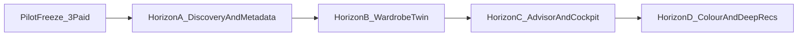

# Roadmap

> **Subordinate to [PHASE.md](./PHASE.md) (ADR-051, 2026-07-27).** During
> the current scope freeze this document is sequencing _history_, not a work
> queue. Nothing here authorises work. If this document and `PHASE.md`
> disagree about what should be built, `PHASE.md` wins — two competing plans
> in one repository is the exact mechanism by which control over this build
> was lost once already. In particular, the "Experience Rebuild" and its
> eight-item commercialisation track below are **paused**, not in progress.
> Horizons A–D (wardrobe intelligence) are post-pilot sequencing intent
> only — see [vision/](./vision/) and ADR-056. **Not a work queue.**

Phased by dependency order — each phase's data model and UI depend on
the ones before it. Not date-committed; sequencing, not scheduling.

## Horizons after pilot proof (not a work queue)

1. **Now (PHASE)** — conversion freeze: storefront, Demo Studio, marketing.
2. **Horizon A — Discovery & Metadata** — Metadata Graph Phase 0–1 + Discovery
   Commerce consumers (filters/knowledge on storefront via data hooks only;
   ADR-052 intact). Specs: [vision/02](./vision/02_metadata_graph.md),
   [vision/01](./vision/01_discovery_commerce.md).
3. **Horizon B — Wardrobe Intelligence Platform** — wardrobe twin on
   `PhysicalGarment` + lifestyle profile + scoring + roadmap.
   Specs: [03](./vision/03_wardrobe_intelligence.md)–[05](./vision/05_lifestyle_intelligence.md),
   [07](./vision/07_wardrobe_scoring.md), [04](./vision/04_wardrobe_roadmap.md),
   [12](./vision/12_garment_lifecycle.md).
4. **Horizon C — Advisor & Cockpit** — AI Style Advisor + Clienteling Cockpit
   - Outfit Intelligence + AI Memory.
     Specs: [06](./vision/06_ai_style_advisor.md), [08](./vision/08_outfit_intelligence.md),
     [09](./vision/09_clienteling_cockpit.md), [13](./vision/13_ai_memory.md).
5. **Horizon D — Colour & deep recommendations** — Colour Intelligence + full
   multi-signal Recommendation Engine + supplier PDF/bulk enrichment at scale.
   Specs: [11](./vision/11_colour_intelligence.md),
   [10](./vision/10_recommendation_engine.md).

Category map: [vision/14_long_term_product_vision.md](./vision/14_long_term_product_vision.md).
Do not invent schema in DOMAIN_MODEL/DATABASE until PHASE authorizes a build.

## Immediate priority — Experience Rebuild (in progress)

The functional roadmap is paused. PAON has broad business capability but has
not passed product-experience acceptance: the portals still read too often as
sparse generic CRM surfaces. The governing plan, persona architecture, route
inventory, acceptance criteria and implementation order now live in
[EXPERIENCE_REBUILD.md](./EXPERIENCE_REBUILD.md).

The original `/Users/nguyen/Downloads/paon.html` is the visual source of truth.
This phase preserves the domain model, database, RLS, authorization and
completed workflows while rebuilding demo truth, entry, shells, role
navigation, attention dashboards, high-frequency journeys and every remaining
route. No prior phase is considered the next implementation queue until every
persona and route passes the desktop/mobile experience criteria or a genuine
founder decision blocks progress.

### Immediate commercialisation track

The Experience Rebuild now includes the Commercialisation and Retailer Demo
System. PAON must let the founder produce one safe, branded, retailer-specific
demonstration in under one hour without code changes or per-retailer forks.
Implementation order:

1. commercial domain, Fused/Half Canvas/Full Canvas plans and entitlements
   — complete;
2. premium public PAON marketing, pricing and persisted inquiry journeys
   — complete as a functional foundation; visual acceptance pending;
3. validated shared retailer theme architecture — complete as a functional
   foundation; visual acceptance pending;
4. Admin prospect workbench and versioned Demo Studio configuration — complete
   as a functional foundation;
5. isolated synthetic demo generation, role/device previews and secure
   publication — next;
6. private personalized proposals;
7. founder sales pipeline and revenue cockpit;
8. approved pilot-to-live onboarding transition;
9. responsive visual and commercial-journey acceptance.

Ordinary backend expansion remains paused. Software subscriptions,
implementation fees and optional managed services remain separate commercial
concepts throughout pricing, proposals and billing.

## Phase 0 — Engineering foundation (done)

Monorepo, shared packages (`domain`, `database`, `auth`, `ui`, `utils`),
full domain model, design tokens, linting/formatting/testing/CI,
Supabase and Vercel scaffolding, and this documentation set. No
application features. Done when: `pnpm build`, `pnpm lint`,
`pnpm typecheck` and `pnpm test` are all green on a repository with
three apps that boot and render a placeholder home page each. ✅ Done.

## Phase 1 — Identity, Retailer, Customer core (done)

Live status: see [PROJECT_STATE.md](./PROJECT_STATE.md). ✅ Done — all
three apps have real auth, the retailer onboarding journey is complete
end to end, and Customer identity (CRM + Customer Portal login +
account linking) is in place. Phase 2 (Catalog and Commerce) is next.

- ✅ Supabase Auth wired into PAON Admin; `@paon/auth` session
  resolution implemented for real (`resolveAppSession`, role guards).
  Retailer Portal and Customer Portal now have the same wiring too —
  all three apps have real auth.
- ✅ `Retailer` create + list + detail in PAON Admin — the onboarding
  flow that creates a tenant and invites its first owner in one step.
- ✅ The retailer owner's side of onboarding: accept the invite
  (`/auth/confirm` → `/accept-invite`), set a password, land in
  Retailer Portal for the first time, retailer status transitions
  `pending_onboarding` → `active` — see `docs/DECISIONS.md` ADR-012.
- ✅ Retailer setup (business profile, billing address) in Retailer
  Portal `/settings`, gated `owner`/`admin`. Locations as a distinct
  entity (multi-store) is not modeled yet — deferred until a slice
  actually needs more than one address per retailer, not built
  speculatively now.
- ✅ `RetailerStaffMember` invitation and role management from inside
  Retailer Portal itself (`/staff`, `/staff/new`) — reuses the same
  accept-invite RPC the first owner uses. Cannot grant `"owner"` — see
  `docs/PROJECT_STATE.md`.
- ✅ `Customer` CRUD in Retailer Portal (`/customers`, `/customers/new`,
  `/customers/[id]`, gated `sales_associate`+); Customer Portal
  passwordless login (`docs/PRODUCT.md` — no OAuth provider wired up
  yet, that needs external credentials this session doesn't have) and
  a dashboard listing the signed-in shopper's linked retailer
  relationships. Linking a Customer Portal login to a per-retailer
  `Customer` record is automatic (`link_my_customer_accounts`, by
  matching email) — see `docs/DECISIONS.md` ADR-013. `Wishlist` shipped in
  Phase 2 alongside the storefront (ADR-026); `CustomerPreferences`
  persistence and a Customer Portal profile-editing UI (`/account`) shipped
  afterward (ADR-028).
- ✅ First real RLS policies and migrations landed in
  `supabase/migrations` (`retailers`, `platform_staff_members`,
  `retailer_staff_members`, `customers`, `customer_account_links`, JWT
  claim-sync triggers, auth helper functions).

This phase proves the multi-tenant foundation end-to-end before any
commerce logic is built on top of it.

## Phase 2 — Catalog and Commerce (in progress)

- ✅ `Product` / `ProductVariant` / `Collection` authoring in Retailer
  Portal (`/products`, `/products/new`, `/products/[id]`,
  `/collections` — gated `manager`+, a stricter minimum than the
  `sales_associate`+ CRM gate, since catalog authoring is a managerial
  task). A product is created with its first variant in the same
  submission — a product with no sellable variant is the same
  "no useless intermediate state" reasoning as retailer
  creation+owner-invite (`docs/DECISIONS.md` ADR-009-adjacent).
- ✅ Storefront browsing (public, path-based — `/r/[slug]/products`) and
  `Order` placement in Customer Portal. `Order` management (fulfillment
  status) in Retailer Portal (`/orders`, gated `production_staff`+).
  Both decided by the human operator rather than guessed — routing
  scheme (path vs. subdomain vs. custom domain) and whether an order
  may exist unpaid — see `docs/DECISIONS.md` ADR-014.
- ✅ Persisted multi-item cart (`/r/[slug]/cart`) — `draft` `Order` per
  retailer relationship, add/update/remove lines, checkout re-validates
  price/stock/currency and collects a shipping address. Buy-now
  (`place_order`) still exists alongside it. See ADR-024.
- ✅ `Payment` integration — Stripe Connect Express, direct charges,
  every retailer merchant of record (founder decision, ADR-030).
  Code-complete and unit-tested; blocked only on a platform operator
  provisioning real Stripe credentials, see `docs/PROJECT_STATE.md`
  "Credentials needed".

## Phase 3 — Production, Alteration, Appointments (in progress)

- ✅ `Appointment` booking foundation: Customer Portal requests one from
  a retailer's storefront (`/r/[slug]/appointments`, no sign-in needed
  to browse, required to submit); Retailer Portal has a calendar-ish
  list, detail, staff assignment, and status management
  (`sales_associate`+), plus `AvailabilityWindow` management (a staff
  member manages their own, `manager`+ manages anyone's). See
  `docs/DECISIONS.md` ADR-015 for why there's no live slot picker on
  the customer side yet (privacy: showing real-time availability would
  otherwise require exposing booking data to anonymous browsers).
- ✅ Production-ready Alterations vertical slice (ADR-016): external/random
  and finished-MTM garment intake; physical-garment fitting observations;
  `work_now` versus manual-future-GoCreate notes; configurable seeded
  premium-menswear operations; effective retailer/workshop Money price lists;
  immutable original quotes and workshop proposal/retailer approval history;
  assignments, worker task notes/review-ready flow, validated append-only
  status history, attachments metadata, chain of custody, completion review,
  notification readiness, pickup/delivery and cancellation audit.
- ✅ Explicit least-privilege alteration access: owner/manager configuration,
  assignment, approval and oversight; advisor intake/fitting/handoffs;
  workshop manager access limited to the assigned workshop; worker access
  limited to directly assigned work; customers limited to safe approved-status
  and pickup/delivery projections; platform oversight retained.
- ⬜ Connector-facing `ProductionOrder` status, staff-facing and
  customer-facing — not started. It must project status from an authoritative
  supplier/manufacturing system, not absorb MTM/specification/construction
  ownership into PAON.
- ⬜ Supplier/manufacturing integrations (e.g. GoCreate) — connectors
  only, per `docs/NORTH_STAR.md`; PAON does not become a manufacturing
  system. Not started, and no connector exists to integrate yet.

This is the phase that differentiates PAON from generic commerce
platforms — see [VISION.md](./VISION.md).

## Phase 4 — Loyalty, Rewards, Referrals, Events

- ✅ `LoyaltyAccount` / append-only `LoyaltyLedgerEntry` accrual when an
  order becomes delivered, with retailer-configurable earning rules.
- ✅ Reward catalogue and transactional customer redemption.
- ✅ Referral invite, signup matching, first-purchase matching and reward
  issuance — the full acquisition journey, not just the invite. See ADR-025.
- ✅ `RetailerEvent` / `EventRsvp` for public, invitation-only and VIP-tier
  trunk shows and events, with capacity-safe customer responses.

## Phase 5 — Engagement and Personalisation

- ✅ `Conversation` / `Message` between customer and retailer staff, with
  participant-only access and shared retailer inbox.
- ✅ In-app `Notification` delivery and read state. Email delivery shipped
  (Resend via a durable outbox + scheduled drain, founder decision,
  ADR-032) — code-complete, blocked only on a platform operator
  provisioning Resend credentials, see `docs/PROJECT_STATE.md`
  "Credentials needed". SMS/push remain credential-dependent adapters,
  no provider chosen yet.
- ✅ Private `ClientelingNote` staff tooling and a unified relationship timeline
  on the retailer customer record.
- ✅ AI personalisation built on `BehavioralEvent` — OpenAI behind a
  provider-neutral interface (founder decision, ADR-033). Next-best-action
  for staff shipped (Retailer Portal customer detail page); product
  recommendations shipped as customer-facing "Today's Pick" (ADR-035);
  personalized customer communication is still modeled
  (`AIGenerationKind`) but not wired to a call site. AI monitoring
  shipped in PAON Admin (`/ai-monitoring`). Code-complete, blocked only
  on a platform operator provisioning an OpenAI API key, see
  `docs/PROJECT_STATE.md` "Credentials needed".
- ✅ Immutable retailer-scoped `BehavioralEvent` capture, actually
  instrumented on the customer storefront (product views, category
  browsing) as of ADR-035, and the first real retailer analytics
  dashboard — the foundation the AI personalisation slice above builds
  its context from. Self-Portrait (ADR-034) is the composed read view
  of this data on the retailer customer record.
- ✅ `WeddingParty` / `WeddingPartyMember` (ADR-035, overriding
  ADR-034's earlier deferral) — an organizer and their invited party
  members, each getting their own guest `Customer` identity and
  self-service fitting-status tracking, staff-managed per retailer.
  Scoped to coordination (roster, fitting status, appointments); no
  wedding-specific marketing/lead-gen funnel was built.

## Phase 6 — Platform maturity

- ✅ Retailer- and platform-scoped analytics dashboards.
- ✅ Retailer subscription billing — Stripe Billing under PAON's own
  platform account (founder decision, ADR-031). Plan assignment
  (PAON Admin), status/renewal display and Stripe-hosted billing
  portal (Retailer Portal `/settings/billing`) are code-complete;
  blocked only on a platform operator provisioning Stripe
  Products/Prices, see `docs/PROJECT_STATE.md` "Credentials needed".
  Self-serve plan upgrade/downgrade and usage-based feature gating
  remain future enhancements — one plan per retailer, platform-staff-assigned only, today.
- Public API (see [API.md](./API.md), [NON_GOALS.md](./NON_GOALS.md) —
  only once a real integration partner exists).
- Anything deferred in [NON_GOALS.md](./NON_GOALS.md) gets re-evaluated
  here, not before.

## Phase 7 — Founder-directed (2026-07-21)

A large batch of asks landed in one session; most shipped the same
session (ADR-036). What's left is recorded below, roughly in the
order it should be picked up.

**Shipped this phase** (see ADR-035/ADR-036 for full reasoning):
Wedding Party self-service invite links; Wedding Party visual
elevation (rounded-xl + shadow-elevated cards, both retailer and
customer); staff planning (`StaffShift` schedule + self-service
`StaffTimeEntry` clock in/out, hours auto-computed); SMS/WhatsApp
pipeline (`@paon/sms`, `sms_outbox`, `/api/cron/dispatch-sms` —
code-complete, blocked only on Twilio credentials, see
`docs/PROJECT_STATE.md` "Credentials needed"); weather-personalized
Today's Pick (live OpenWeatherMap key, needs `OPENWEATHER_API_KEY` set
on Vercel — see "Credentials needed"); newsletter signup +
`newsletter_subscribers` + daily digest route (not on a cron schedule
yet, see below); shipping/carrier preference on the customer record
(`customers.preferred_carrier`, UI-only, no live carrier API); the
back-office premium visual pass (serif display heading carried across
all 45 retailer/admin pages) — a first pass at applying paon.html's
language everywhere, not the full component-by-component treatment
the customer storefront got; real design tokens extracted from
paon.html (easing curve, glass material, elevation shadows), a global
touch-safe `hover` variant and 44px+ active/tap states project-wide,
glass-panel nav headers, and an accessibility pass on the previously
visually-unverified components.

**Shipped, second follow-up** (ADR-037): a full UX & Logic Audit of
both portals — "Needs your attention" dashboards (retailer and
customer) replacing a stale placeholder and a plain relationship list;
alteration pricing approvals moved to the top of the detail page;
grouped navigation plus a mobile bottom tab bar (Customer Portal); cart
quantity steppers/Remove/sticky mobile checkout bar, all 44px+ tap
targets, proven by new Playwright specs. Also found and fixed, mid-
verification: `@paon/ui` component base classes (Button's
`inline-flex`/`h-*`/`gap-2`) were absent from every app's compiled CSS
— Tailwind v4 never follows the `node_modules/@paon/ui` workspace
symlink without an explicit `@source` directive. Fixed once, in
`packages/ui`, retroactively correct for every app.

**Still open:**

- **Newsletter digest scheduling.** `/api/cron/dispatch-newsletter`
  exists and works when triggered, but isn't in `vercel.json` —
  Vercel's Hobby plan caps cron jobs per project and
  `dispatch-emails`/`dispatch-sms` already use the available slots.
  Needs either an external scheduler (e.g. a free cron-ping service
  hitting the URL with `CRON_SECRET`), folding into an existing daily
  cron tick, or a Vercel plan upgrade.
- **Real carrier API integration.** The `preferred_carrier` field
  records staff's chosen arrangement only — no DHL/PostNL/UPS/FedEx
  label generation, rate shopping or tracking exists. A real
  integration needs actual carrier credentials this deployment does
  not have.
- **Back-office visual pass, remaining depth.** Headings and every
  list/roster Card (rounded-xl + shadow-elevated) now match across all
  of `apps/retailer`/`apps/admin`, and Retailer Portal `/products` now uses a
  responsive image-led product grid instead of a roster list. Not yet carried:
  `--font-accent` eyebrow-label styling (still storefront-only) or a broader
  redesign of detail-page forms and inputs beyond the original quiet/editorial
  component set.
- **Alteration operation depth beyond cost controls.** Cost-control
  hardening shipped (ADR-036); per-employee photo/notes/operational attribution
  is now audited, database-derived where callers previously could submit it,
  and visible across the retailer workflow (ADR-039). Customer-facing
  alteration-readiness notifications now ship through the existing
  in-app/email/SMS pipeline (ADR-038); native push still needs a provider
  decision and credentials. A dedicated manager cost-approval dashboard
  distinct from the pricing-history Card that shipped is not built.
- **Dynamic pricing / idle-customer re-engagement.** "Full insight
  into customer online behavior... dynamic pricing... track buying
  patterns... know when to clientele" is a real analytics/personalisation
  engine, not a UI feature — needs its own domain concept (a
  "re-engagement window" or "purchase cadence" model per customer,
  computed from `BehavioralEvent`/`Order` history) and a pricing-rules
  concept that doesn't exist anywhere in the current commerce domain
  (today: one fixed price per `ProductVariant`, no discount/promotion
  primitives at all). The single largest item on this list — deserves
  its own dedicated design pass, not a bolt-on.

## How this roadmap changes

A phase only starts once the previous phase's data model has real
retailers and customers using it — sequencing is intentionally strict
because each phase's UI and business logic assume the previous phase's
records exist and are correct. Reordering requires updating this
document and, if it changes a dependency assumption, adding an entry to
[DECISIONS.md](./DECISIONS.md).
