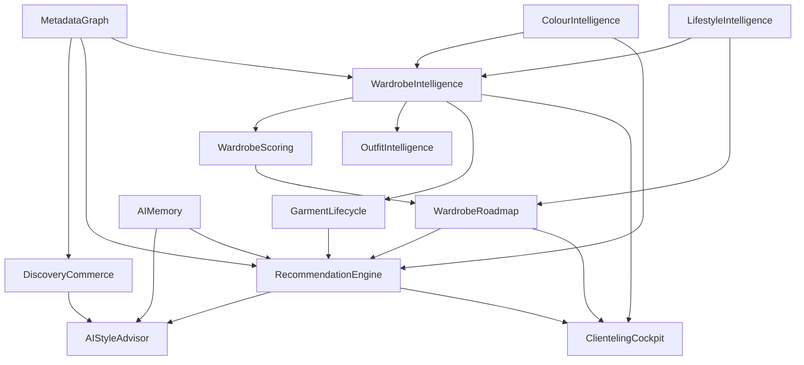

# Vision system — Lifelong Wardrobe Intelligence

**Status: architectural destination, not shipped software.**
Nothing in this folder authorizes implementation. [PHASE.md](../PHASE.md)
alone decides what may be built. If a vision doc and the code disagree,
the code and [PROJECT_STATE.md](../PROJECT_STATE.md) win — fix the vision
doc or open an ADR. See ADR-056 in [DECISIONS.md](../DECISIONS.md).

## Why this folder exists

Discovery Commerce and a Universal Metadata Graph are roughly a quarter of
the long-term ambition. The category claim is larger: **PAON owns personal
wardrobe intelligence** the way Apple Health owns health — a lifelong
advisor for the client’s clothing life, delivered through a RetailOS that
independent menswear houses run.

Writing one mega-prompt that “does everything” produces shallow design.
Each file below is a first-class pillar. Read the one you need; do not
load the whole set into context.

## Semantic spine

Every pillar that reasons about products, garments, occasions, climate or
style **must consume the Metadata Graph** ([02_metadata_graph.md](./02_metadata_graph.md)).
No pillar invents a parallel free-text tagging system or one-off Product
columns for weave/season once the graph exists.

Today’s catalog is thin (`Product` / `Variant` / `Collection`). Storefront
category, colour, pattern and season are still **keyword heuristics** in
`apps/customer/app/r/[slug]/route.ts` — not persisted. Displacing those
heuristics is Horizon A work after the freeze, not a side project.

## Dependency graph

## Read order

1. [14_long_term_product_vision.md](./14_long_term_product_vision.md) — category claim
2. [02_metadata_graph.md](./02_metadata_graph.md) — OS spine
3. [03_wardrobe_intelligence.md](./03_wardrobe_intelligence.md) — digital twin
4. Then the pillar you are designing against

## Pillars

| #   | Document                                                           | Pillar                         |
| --- | ------------------------------------------------------------------ | ------------------------------ |
| 01  | [01_discovery_commerce.md](./01_discovery_commerce.md)             | Discovery Commerce             |
| 02  | [02_metadata_graph.md](./02_metadata_graph.md)                     | Universal Metadata Graph       |
| 03  | [03_wardrobe_intelligence.md](./03_wardrobe_intelligence.md)       | Personal Wardrobe Intelligence |
| 04  | [04_wardrobe_roadmap.md](./04_wardrobe_roadmap.md)                 | Wardrobe Roadmap               |
| 05  | [05_lifestyle_intelligence.md](./05_lifestyle_intelligence.md)     | Lifestyle Intelligence         |
| 06  | [06_ai_style_advisor.md](./06_ai_style_advisor.md)                 | AI Style Advisor               |
| 07  | [07_wardrobe_scoring.md](./07_wardrobe_scoring.md)                 | Wardrobe Scoring               |
| 08  | [08_outfit_intelligence.md](./08_outfit_intelligence.md)           | Outfit Intelligence            |
| 09  | [09_clienteling_cockpit.md](./09_clienteling_cockpit.md)           | Retailer Clienteling Cockpit   |
| 10  | [10_recommendation_engine.md](./10_recommendation_engine.md)       | AI Recommendation Engine       |
| 11  | [11_colour_intelligence.md](./11_colour_intelligence.md)           | Colour Intelligence            |
| 12  | [12_garment_lifecycle.md](./12_garment_lifecycle.md)               | Garment Lifecycle              |
| 13  | [13_ai_memory.md](./13_ai_memory.md)                               | AI Memory                      |
| 14  | [14_long_term_product_vision.md](./14_long_term_product_vision.md) | Long-term product vision       |

## Shared template (every pillar)

1. Problem / non-goals for this pillar
2. Bounded context and intended entities (**not in schema unless PROJECT_STATE says so**)
3. Relationships to other pillars (especially Metadata Graph)
4. Consumer surfaces (customer / retailer / admin / AI)
5. Data ownership and tenancy (`retailerId`, customer privacy)
6. AI contracts (inputs, outputs, explainability, confidence)
7. Phased delivery (P0 conceptual → P1 schema → P2 thin UI → P3 intelligence)
8. Dependencies and freeze blockers
9. Open research questions

## Horizon sequencing (see ROADMAP.md)

Not a work queue during freeze. Dependency order after pilot proof:

- **Horizon A** — Metadata Graph + Discovery Commerce consumers
- **Horizon B** — Wardrobe twin + Lifestyle + Scoring + Roadmap
- **Horizon C** — Advisor + Clienteling Cockpit + Outfit + Memory
- **Horizon D** — Colour + full Recommendation Engine + supplier enrichment at scale

## Existing seeds (do not invent from zero)

- `PhysicalGarment`, fitting observations, alterations lifecycle
- `CustomerPreferences`, wishlist, behavioral events, AI generation kinds
- Thin catalog + Collection M2M
- Do **not** revive archived customer-level fit profiles (ADR-016 / ADR-055) under a new name without a new ADR
- Do **not** treat Collection as Brand ([COMPETITIVE_GAPS.md](../COMPETITIVE_GAPS.md))
